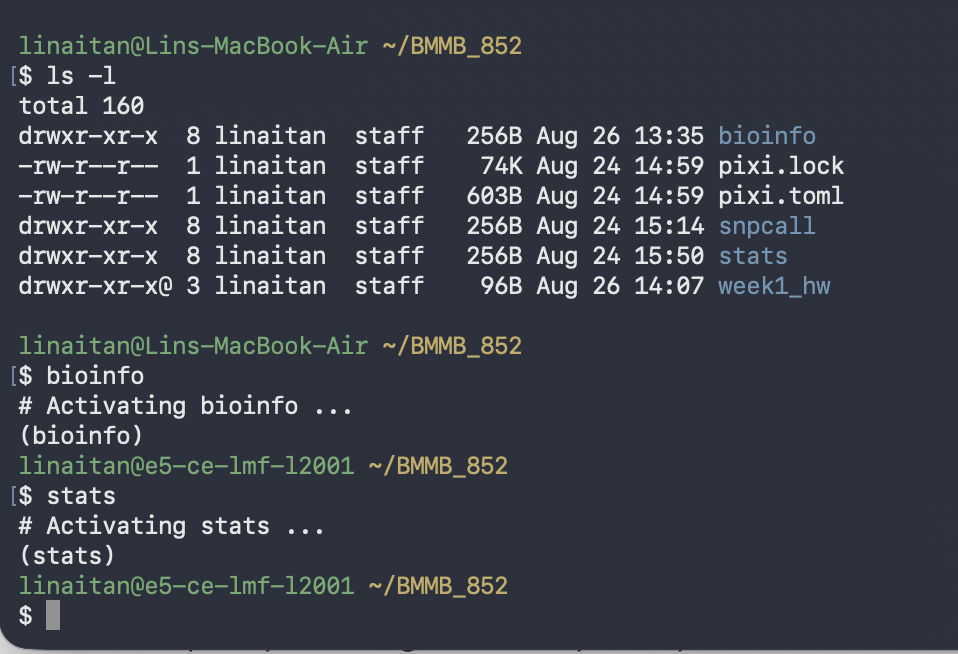
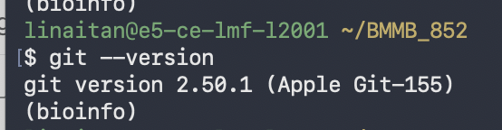
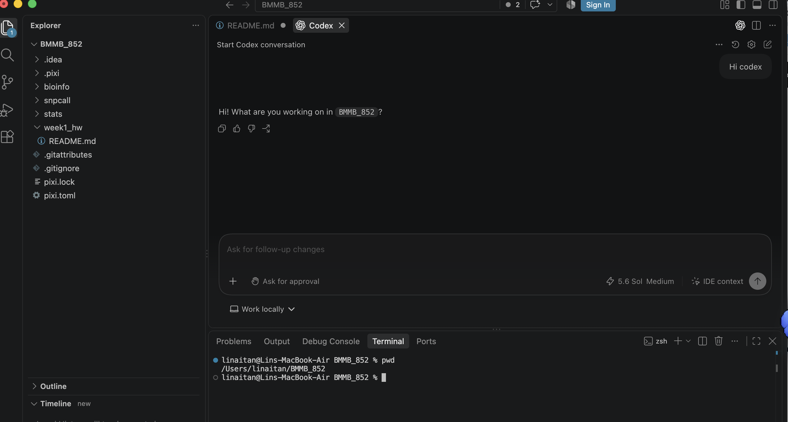

## Name: Linai Tan

### Proof of computer setup



### AI code editor
VSCode


### Github account
https://github.com/ltan2/BMMB_852.git

### Create dir and README
```bash
mkdir week1_hw # create dir
touch week1_hw/README.md # create file
```

### samtools version
```bash
linaitan@e5-ce-lmf-l2001 ~/BMMB_852
$ samtools --version
samtools 1.24
(bioinfo)
```

### Create nested directory and file
```bash
mkdir -p week1_hw/images # create parent and child dir
touch week1_hw/README.md # create file
```

### Create files in different directory
```bash
touch week1_hw/hello.txt # create in week1_hw dir
touch hello.txt # create in curr dir
```

### Access file in relative and absolute path
```bash
pwd
/Users/linaitan/BMMB_852

ls . # list file/dir in relative path
ls /Users/linaitan/BMMB_852 # list file/dir in absolute path
vi week1_hw/README.md # open file using relative path
vi /Users/linaitan/BMMB_852/week1_hw/README.md # open file using absolute path
```
