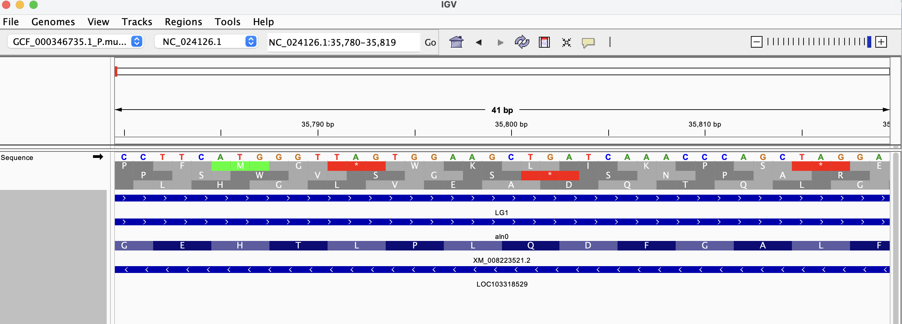
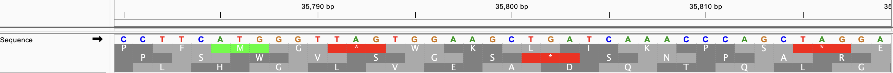
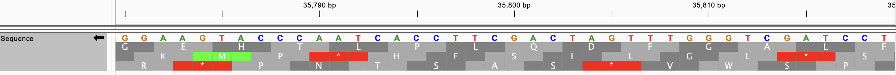
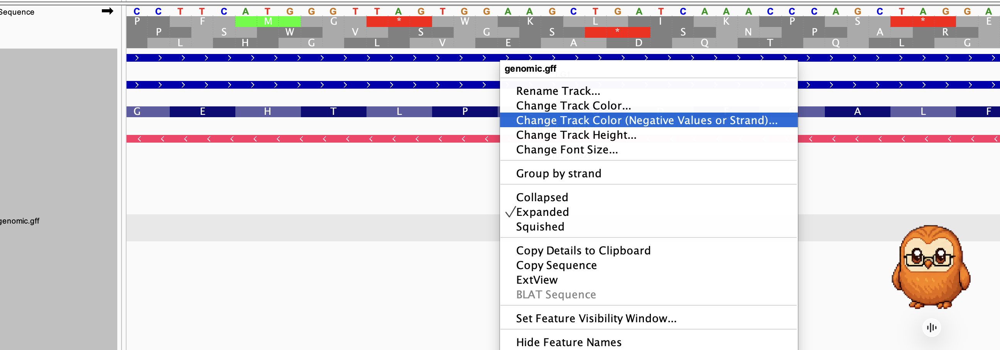
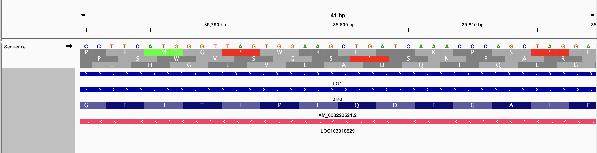

# Week 2 Homework

This README explains the commands in the Makefile and then a simple analysis of my chosen genome in IGV.

## Table of contents

1. [Makefile](#makefile)
2. [Sample analysis](#sample-analysis)

## Makefile

### Requirements

You need `make`, `curl`, `gzip`, and an internet connection.

### Supported commands

#### 1. To download the genome and its annotation:

```bash
make <ncbi_accession_id>
```

Example:
```bash
make GCF_000346735.1
```
This command downloads both the genome
sequence (FASTA) and its annotation (GFF) from NCBI via curl. If both files already exist, the
command finishes successfully without downloading them again.

The files are then organized by file type:

```text
data/
├── fasta/
│   └── GCF_000346735.1.fna
└── gff/
    └── GCF_000346735.1.gff
```

- `data/fasta/` contains the genome sequence.
- `data/gff/` contains the genome annotation.

#### 2. To count annotations by feature type
```bash
make count <ncbi_accession_id>
```
Example:
```bash
make count GCF_000346735.1
```
Example output:
```bash
Total annotations: 445905
Breakdown by feature type:
CDS 171499
cDNA_match 3670
exon 202771
```

This command ignores comment lines to count GFF records, and groups them
by the feature type in column 3 (for example, `gene`, `mRNA`, `exon`, and
`CDS`). It downloads the GFF file first if it is not already present.

#### 3. To cleanup

Remove the downloaded files with:

```bash
make clean
```
This command does not remove the Makefile or README.md but removes all the files and the data directory.

## Sample analysis

### Selected genome

I selected *Prunus mume* (Japanese apricot/Umeboshi). Its GenBank assembly accession is
`GCF_000346735.1`, and its assembly name is `P.mume_V1.0`.

Insert picture of what Umeboshi looks like cause I got hungry doing this assignment lol


Use the Makefile for this genome with:

```bash
make GCF_000346735.1
```

#### Question 1: How large is the genome? How many chromosomes does it have?
According to NCBI, the size of the genome is 233.9 Mb and it has 8 chromosomes

#### Question 2: How many annotations are in the annotation file?
There are 445905 in total. Obtained by counting all non-comment lines containing at least nine tab-separated columns as all valid annotations should have the fields

```bash
make count GCF_000346735.1
```

Output:
```bash
Total annotations: 445905
Breakdown by feature type:
CDS 171499
cDNA_match 3670
exon 202771
gene 25028
lnc_RNA 1502
mRNA 29705
match 470
pseudogene 1496
rRNA 8
region 8164
tRNA 473
transcript 1119
```
Precisely for gene annotations there are 25028 of them

#### Question 3: How complete is this genomic build in your opinion?
In my opinion, the genome is fairly complete because from the GFF of the eight chromosome regions, approximately 85.02% of the nuclear assembly is assigned to chromosomes, while 14.98% remains unplaced.

The number is obtained from the following calculation:

```bash
awk -F '\t' '$3=="region"{n=$5-$4+1;if($9~/genome=chromosome/)c+=n;if($9!~/genome=plastid/)t+=n}END{print 100*c/t}' data/gff/GCF_000346735.1.gff
```

I calculate the total length of the nuclear genome, including both chromosomes and unplaced scaffolds, and then divide the length assigned to chromosomes by this total. The plastid genome is excluded because it is separate from the nuclear genome. This calculation gives the percentage of the nuclear assembly organized into chromosomes.

### Visualize a Genome

#### Question 1: How tightly packed are the genes in this genome? Estimate the gene-to-gene distance via the browser

They are about 400-500kb apart, so I would not consider them tightly packed


#### Question 2: Pick a coordinate on the chromosome and visually inspect the sequence regions around it.
I picked NC_024126.1:35,800


It looks like this coordinate is in the region containing the gene LOC103318529. The gene is located on the negative strand as its arrows are pointed backwards and there is also one annotated transcript, XM_008223521.2

#### Question 3: Describe all six reading frames (codons) that the coordinate could be part of.
At coordinate 35800, the forward reading:

The 3 reading frames are: L(leucine),S(serine),A(alanine)

The backward reading:

The 3 reading frames are: Q(glutamine), S(serine), A(alanine)

#### Question 4: Identify the type of feature displayed as a data track.
The data track displayed is the sequence

#### Question 5: Color features by their strand orientation.


I picked red, so now my negative strand is red


