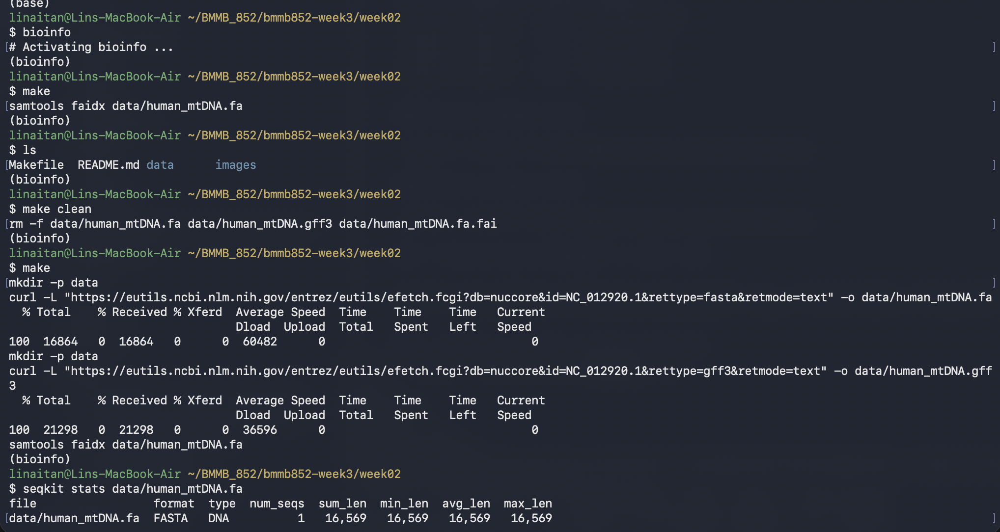

## Week 3 assignment

### Fork the clone one of the repositories you were assigned to review.
I decided to fork https://github.com/AmanuelMD/bmmb852. My copy is https://github.com/ltan2/bmmb852-week3

### Verify that the code is not doing something dangerous.
I can verify that the code is not malicious and the Makefile performs downloads and indexing of the genome and its annotation

### Evaluate the README.md of the assignment. Does the README.md make it clear how to run the code and what the outcomes are?
Yes, the README for the repo that I forked is very well written and reproducible. It explains the commands that are supported in the Makefile and gives a clear analysis of the chosen genome in IGV completed with screenshots

### Verify that the results are reproducible. Does the code do what the author says it does?
Yes, I was able to run all the code and get the expected results


### Ask the AI Agent to compare your solution to theirs.
Below is the prompt that I used:

```text
Can you compare the solution in week2_hw subdir to bmmb852-week3/week02. Both are analyzing different genome, but can you compare correctness and equivalence if for example they're the same genome. Put it in table format
```

Below is the output I obtained:
<details>
<summary> Click here to view the output of my AI agent (Codex GPT 6 Astra)</summary>
**Both solutions are mostly correct, but they are not fully equivalent.** I checked their READMEs, Makefiles, local FASTA/GFF files, and selected screenshots.

Here, “same genome” means **the same assembly version, sequence coverage, and annotation release**. Using the same organism alone would not guarantee matching results.

| Aspect | `week2_hw` | `bmmb852-week3/week02` | Correctness and equivalence on identical input |
|---|---|---|---|
| **Download scope** | Downloads an entire *Prunus mume* assembly using a `GCF_` accession. | Downloads one mitochondrial sequence using an `NC_` accession. | Both suit their selected genomes. **Not interchangeable as written:** downloading one chromosome is different from downloading its entire assembly. |
| **Genome size** | Reports **233.9 Mb**. Local nuclear sequence totals **233,872,527 bp**; the complete FASTA, including plastid, totals **234,030,239 bp**. | Reports **16,569 bp**, verified from the FASTA. Provides a `seqkit stats` command. | Both numbers are correct with their respective scope. The plant answer should explicitly say **nuclear genome size**. Same-input totals agree only if organelles are handled consistently. |
| **Chromosome count** | Reports **8 chromosomes**, supported by eight chromosome `region` records. The FASTA contains **8,164 sequences**, including unplaced sequences and plastid. | Reports one circular mitochondrial molecule, represented by one FASTA sequence. | Both correct. **FASTA sequence count is not generally chromosome count**; the mitochondrial shortcut would not work for the plant assembly. |
| **Total annotations** | Reports **445,905**; independently verified. Counts non-comment rows with `NF >= 9`. | Reports **101**; independently verified. Counts non-comment rows with `NF == 9`. | **Equivalent for both actual files**, whose annotation rows all have exactly nine columns. `>= 9` additionally accepts malformed rows with extra columns. |
| **Feature counts** | All reported counts match, including **25,028 `gene` rows** and **1,496 separate `pseudogene` rows**. Automates the breakdown. | All reported counts match, including **37 genes**, **13 CDS**, **22 tRNAs**, and **2 rRNAs**. | Equivalent when counting the same feature types. Annotation rows are not necessarily unique biological features: one CDS can occupy multiple rows. |
| **Assembly completeness** | The **85.02% chromosome-assigned** result is correct; recalculation gives **85.026%**. | A complete circular reference with the expected gene inventory supports high completeness. | **Different assessments.** Chromosome placement measures assembly organization, not how much of the biological genome is present. The plant formula would return **0%** on this mitochondrial GFF, so it cannot transfer unchanged. |
| **Completeness caveats** | “Fairly complete” is stronger than the placement percentage alone establishes. | “No reported gaps or unresolved bases” needs qualification: the FASTA contains **`N` at position 3107**. | The mitochondrial `N` is a historical numbering spacer, so it does **not** establish an assembly failure. Both explanations could be more precise. |
| **Gene spacing** | Estimates **2–3 kb** from a local browser view. The screenshot also shows a substantially larger gap, so this is not a demonstrated genome-wide typical distance. | Gives **0–10 bp**, overlaps, and a concrete ATP8/ATP6 example. I verified the **46-bp overlap**; 28 of 36 consecutive gene pairs have gaps of 0–10 bp. | The mitochondrial answer is better supported. On identical input, comparisons require the same interval and definition of spacing—preferably end-to-start distance. |
| **Selected coordinate** | **35,800** lies within negative-strand `LOC103318529`, its stated transcript, and a CDS. | **9,363** lies within positive-strand `COX3` and its CDS. | **Both correct**, verified against their GFF files. Equivalent if the same sequence and coordinate are selected. |
| **Six reading frames** | Reported forward amino acids **L/S/A** and reverse **Q/S/A** match the possible codons containing the coordinate. | All six listed codons and translations match the FASTA. | **Biologically equivalent approach**, but the mitochondrial answer more fully answers “codons.” The plant answer should add the nucleotide triplets. Frame ordering should be defined before comparing row by row. |
| **Feature identification** | Identifies the clicked feature as a **gene**, supported by its screenshot. | Describes the different feature types in the entire annotation track. | Both correct at different levels: one identifies a particular feature; the other describes the track contents. |
| **Strand visualization** | Uses blue for forward and red for reverse features. | Uses the same colors and groups features by strand. | Equivalent strand information; grouping changes presentation. |
| **Automation and indexing** | Automates downloading and feature counting; does not generate a FASTA index. | Automates downloading and `samtools faidx`; counting is documented separately. | Complementary strengths. Indexing improves loading efficiency but does not change biological results. |
| **Download robustness** | Uses `curl -fL` and `.DELETE_ON_ERROR`; pipeline failure handling could still improve. | Uses `curl -L` without HTTP-error rejection or `.DELETE_ON_ERROR`. | The plant workflow has stronger failure handling. The mitochondrial workflow can retain an HTTP error response or partial download as an apparent output file. |
| **Changing genomes** | README suggests arbitrary accession support, but the assembly name and FTP directory are hardcoded. | Accession is configurable, but output filenames remain `human_mtDNA.*`; existing files prevent automatic replacement. | **Neither is a general genome-switching workflow as written.** Both require changes beyond simply substituting an accession in the documented command. |

For the reading-frame comparison, your plant coordinate’s codons are **`CTG` → L, `AGC` → S, `GCT` → A** on the forward strand and **`CAG` → Q, `AGC` → S, `GCT` → A** on the reverse strand.

**Overall:** the core counting and coordinate analyses agree in correctness. The mitochondrial solution provides stronger quantitative support for gene spacing and clearer codon reporting; the plant solution provides better automated counting and download safeguards. The most important conceptual correction is to distinguish **chromosome placement from genome completeness**.
</details>

### Ask the AI Agent to evaluate which solution it thinks is better.
Below is the prompt that I used:

```text
Assuming you want to analyze your own genome, can you evaluate which solution you thinks is better. Put it in table format the metric you use to arrive to your choice
```

Below is the output I obtained:
<details>
<summary> Click here to view the output of my AI agent (Codex GPT 6 Astra)</summary>
**I would choose `week2_hw` as the starting point for analyzing another assembled genome**, particularly one with multiple chromosomes and unplaced scaffolds. `bmmb852-week3/week02` is better as a clearly documented analysis of one small reference sequence.

Scores below are qualitative: **1 = weak, 5 = strong**. Weights reflect what matters when adapting the workflow to a new genome.

| Metric | Weight | `week2_hw` | `bmmb852-week3/week02` | Reason |
|---|---:|---:|---:|---|
| Whole-assembly support | 25% | **5** | **2** | The plant workflow retrieves an entire assembly; the mitochondrial workflow retrieves one sequence. Assembly scope matters for genomes containing many chromosomes and scaffolds. |
| Automated analysis | 20% | **4** | **2** | The plant Makefile calculates annotation totals and feature breakdowns. The mitochondrial workflow requires separate manual analysis commands. |
| Ease of changing genomes | 15% | **2** | **2** | Both need improvement: the plant download path is hardcoded; the mitochondrial workflow retains fixed filenames and can reuse stale files after an accession change. |
| Download reliability | 15% | **4** | **2** | The plant workflow rejects HTTP errors and deletes targets when a recipe fails. The mitochondrial workflow lacks those protections. Neither validates downloaded content comprehensively. |
| Scientific interpretation | 15% | **3** | **4** | Both counts and coordinate interpretations are correct. The mitochondrial solution supports spacing more convincingly; the plant solution overinterprets chromosome placement as completeness. |
| Documentation and visualization setup | 10% | **3** | **5** | The mitochondrial solution includes FASTA indexing, a sequence-statistics command, explicit codons, and clearer reproduction steps. |
| **Weighted score** | **100%** | **3.70 / 5** | **2.60 / 5** | **`week2_hw` wins for adaptation to a general assembled genome.** |

| Intended use | My choice | Why |
|---|---|---|
| Analyze a new multichromosome reference assembly | **`week2_hw`** | Better download scope and reusable annotation counting. |
| Analyze a single mitochondrial or other small sequence | **`bmmb852-week3/week02`** | Simpler setup with indexing and a clearer worked example. |
| Analyze an existing local FASTA and GFF | **Slight preference: `week2_hw`** | Its automated counting is useful, but file paths and download dependencies need adaptation. |
| Analyze personal sequencing reads or call genetic variants | **Neither** | Neither workflow performs read quality control, alignment, variant calling, or variant interpretation. |

My preferred implementation would retain **`week2_hw`’s assembly download and counting**, add **the mitochondrial solution’s indexing and sequence statistics**, and replace the hardcoded inputs with configurable FASTA/GFF paths.
</details>


### In a paragraph or two, summarize your findings above.
Overall, I agree with the AI agent’s findings based on the evaluated metrics. Both solutions use valid code and provide largely correct biological analyses, although some interpretations need clarification. For reproducing the analysis of the same genome, `bmmb852-week3/week02` provides clearer and more complete instructions. For adapting the workflow to a different genome, `week2_hw` offers stronger error handling and more automated analysis. Overall, `week2_hw` provides a stronger foundation for a reusable workflow, while `bmmb852-week3/week02` offers more detailed biological explanations and better-supported findings. Both are useful solutions with room for improvement.

### Make a change to the forked repository that addresses an issue you found.
Although it was not an existing issue, the AI agent suggested improving error handling in the repository I forked. I added `.DELETE_ON_ERROR:`, which tells Make to delete an output file modified by a failed command. This helps prevent incomplete downloads from being retained and treated as complete files.

### Pull request
https://github.com/AmanuelMD/bmmb852/pull/1
