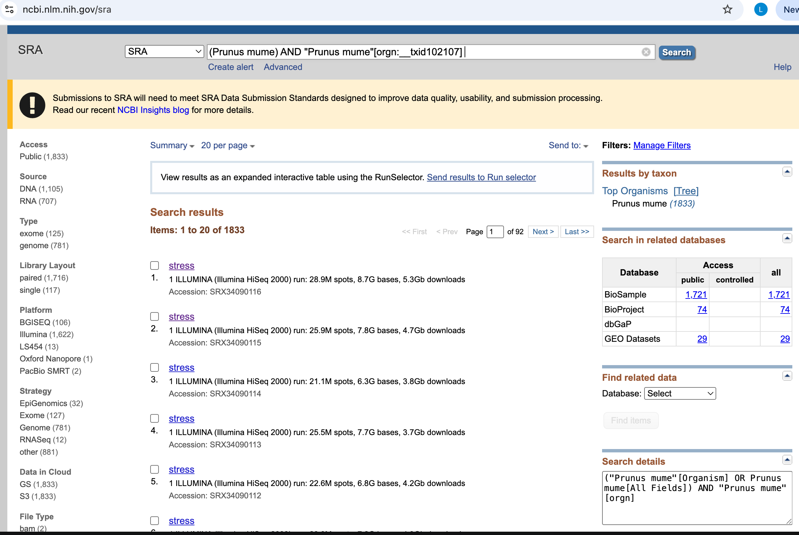
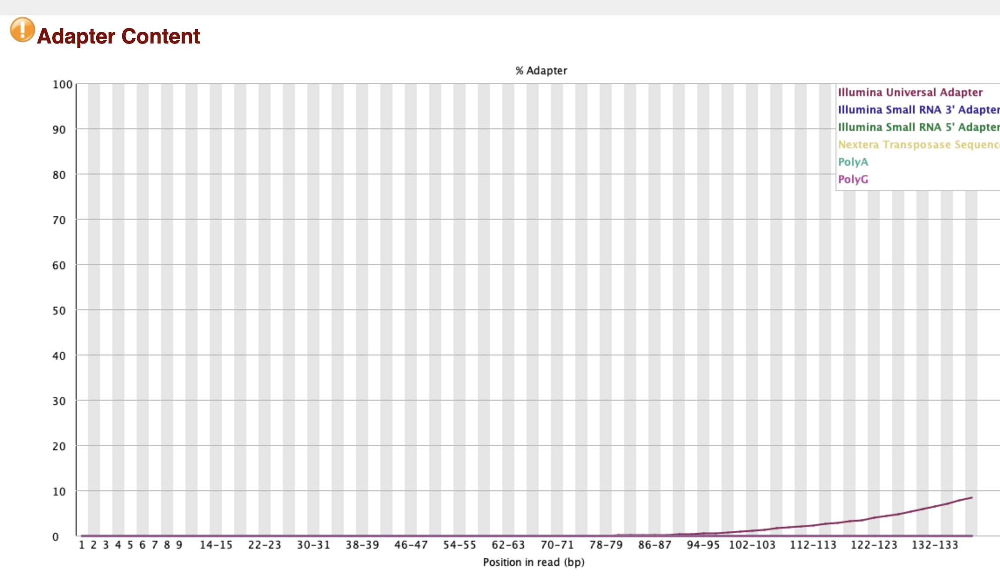
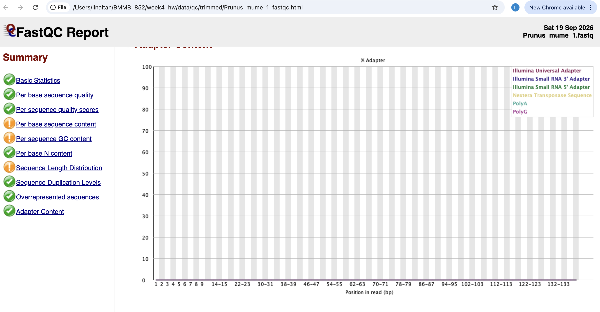

## Assessing the experimental evidence for the genome



#### How "popular" is this genome? How many datasets are available?
This genome is not very popular as there are only 1833 results returned for "(Prunus mume) AND "Prunus mume"[orgn:__txid102107]" and submitted roughly by the same groups of organization. There are 1105 DNA datasets and 707 RNA datasets available 

#### What is the breakdown by sequencing strategy and platform (or some other attribute)?
The breakdown are as follow for sequencing technology:

```text
EpiGenomics(32)
Exome(127)
Genome(781)
RNASeq(12)
other(881)
```

The breakdown are as follow for platform:

```text
BGISEQ(106)
Illumina(1,622)
LS454(13)
Oxford Nanopore(1)
PacBio SMRT(2)
```

#### What do you find interesting or surprising?

It is striking that Illumina accounts for 1,622 of the 1,744 results assigned to a listed platform, whereas Oxford Nanopore and PacBio SMRT together account for only three. The small number of records labeled RNASeq compared with the reported number of RNA datasets also shows that sequencing strategy and molecule type are different classifications.

## Makefile guide

To download. Note that files will be rename to its genome name for readability:
```bash
make download SRR_ID=<SRR_ID>
```
You can also pass in the how many N reads, default is 10000

```bash
make download SRR_ID=<SRR_ID> N=<num_reads>
```
Example:
```bash
make download SRR_ID=SRR39371950 N=10000
```

Run a QC visualization on the downloaded reads
```bash
make qc FILES=<path_to_files>
```
Example:
```bash
make qc FILES='data/fastq/*.fastq'
```

Apply a QC method to the reads (We use fastp here to trim)
```bash
make trim FILES=<path_to_files>
```
Example:
```bash
make trim FILES='data/fastq/*.fastq'
```

Run a QC visualization on the trimmed reads to generate a report.
```bash
make qc-trim FILES=<path_to_files>
```
Example:
```bash
make qc-trim FILES='data/trimmed/*.fastq'
```

Files will be placed in its own respective dir:
```bash
├── Makefile
├── README.md
├── data
│   ├── fastq
│   │   ├── Prunus_mume_1.fastq
│   │   └── Prunus_mume_2.fastq
│   ├── qc
│   │   ├── raw
│   │   │   ├── Prunus_mume_1_fastqc.html
│   │   │   └── Prunus_mume_2_fastqc.html
│   │   └── trimmed
│   │       ├── Prunus_mume_1_fastqc.html
│   │       └── Prunus_mume_2_fastqc.html
│   └── trimmed
│       ├── Prunus_mume_1.fastq
│       └── Prunus_mume_2.fastq
└── images
    └── hw4.png
```

It can also download reads from different sequencing platforms or different database by changing the accession number alone.
```bash
make download SRR_ID=SRR34067721 N=10000
```

```bash
make download SRR_ID=DRR1098624 N=10000
```

Use `make clean` to remove the generated data dir

## QC comparison
Please refer to Makefile guide on how to run qc

Before qc:


After qc:


My comparison after running fastp:
- After trimming, 9,942 reads remain—only 58 read pairs (0.58%) were removed.
- “Adapter Content” improved from warning in the raw reports to pass after trimming.
Overall, trimming didn't yield any meaningful change aside from resolving adapter contamination and low-quality ends while retaining more than 99% of the reads.


