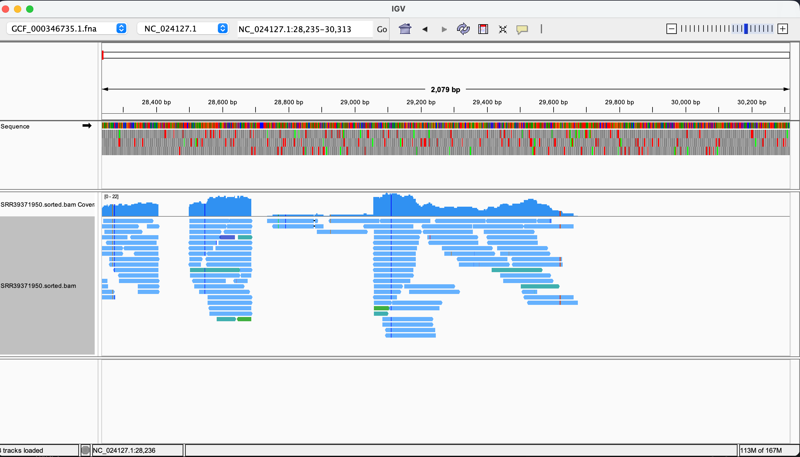
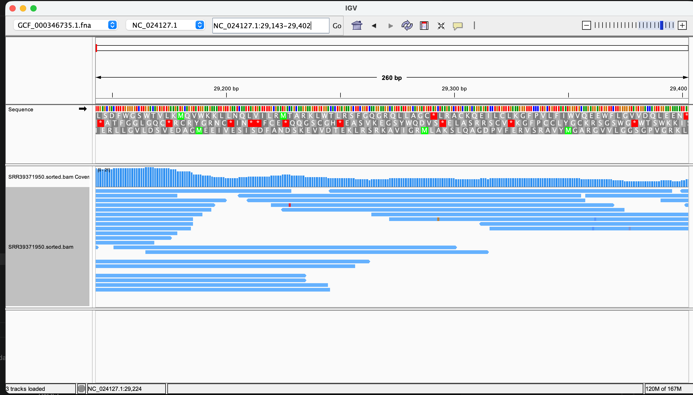

# Homework 5: Read alignment and BAM statistics

This workflow aligns paired-end reads from `SRR39371950` to the *Prunus mume* reference assembly `GCF_000346735.1_P.mume_V1.0` using BWA-MEM. Samtools sorts and indexes the BAM and produces alignment and coverage reports. This workflow assumes paired-end short DNA reads; confirm the SRA library strategy before use. RNA-seq requires a splice-aware aligner.

**Result:** 

First, lets make sure Makefile runs well
```code
make all N=1000000# this runs downloads, alignment, BAM indexing, and statistics
```

Inspecting my file outcomes
```code
├── Makefile
├── README.md
└── data
    ├── bam
    │   ├── SRR39371950.sorted.bam
    │   └── SRR39371950.sorted.bam.bai
    ├── fasta
    │   ├── GCF_000346735.1.fna
    │   ├── GCF_000346735.1.fna.amb
    │   ├── GCF_000346735.1.fna.ann
    │   ├── GCF_000346735.1.fna.bwt
    │   ├── GCF_000346735.1.fna.fai
    │   ├── GCF_000346735.1.fna.pac
    │   └── GCF_000346735.1.fna.sa
    ├── fastq
    │   ├── SRR39371950_1.fastq
    │   └── SRR39371950_2.fastq
    └── reports
        ├── SRR39371950.coverage.tsv
        └── SRR39371950.flagstat.txt
```

#### Explain how you arrived at N
My results are based on `N=1000000`. I chose `N=1000000` instead of Makefile default of 10000 because I want read pairs to balance coverage with runtime and storage requirements. With reads approximately 150 bases long and a reference genome of about 234 million bases, this provides an estimated 1.28× coverage before trimming and mapping losses.

#### What percent of the reads align?
```
2482631 + 0 in total (QC-passed reads + QC-failed reads)
2000000 + 0 primary
0 + 0 secondary
482631 + 0 supplementary
0 + 0 duplicates
0 + 0 primary duplicates
2438482 + 0 mapped (98.22% : N/A)
1955851 + 0 primary mapped (97.79% : N/A)
2000000 + 0 paired in sequencing
1000000 + 0 read1
1000000 + 0 read2
1808588 + 0 properly paired (90.43% : N/A)
1946454 + 0 with itself and mate mapped
9397 + 0 singletons (0.47% : N/A)
19432 + 0 with mate mapped to a different chr
12264 + 0 with mate mapped to a different chr (mapQ>=5)
```
Of the 2,000,000 primary reads, 1,955,851 aligned to the reference genome, giving a primary alignment rate of 97.79%, according to data/reports/SRR39371950.flagstat.txt generated by make stats N=1000000. The remaining 44,149 reads, approximately 2.21%, did not align.
In addition, 90.43% of all primary reads were marked as properly paired, meaning the aligner considered their paired-end arrangement consistent with its expectations.

#### What do the alignments look like? Do the reads show errors or variations?

In the wider displayed region, NC_024127.1:28,235-30,313, reads form overlapping stacks separated by gaps. Most aligned bases appear to match the reference, with some colored mismatch marks. Many reads have similar starting or ending positions, producing distinct clusters rather than an even distribution across the region. Most aligned positions do not show mismatch marks and therefore appear consistent with the reference sequence.
Some colored mismatch marks occur at the same reference position in several overlapping reads


When zooming in on a region, example: NC_024127.1:29,143–29,402, A few isolated colored mismatch marks are visible, but there is no obvious column of the same mismatch supported by many reads. These isolated differences may represent sequencing or alignment errors; this view alone does not establish a biological variant. Coverage is continuous across this selected 260-base region but varies in depth, reaching approximately 21 reads near the left side and decreasing toward the right.

#### Is the coverage uniform?
Coverage is not uniform. In the wider IGV view, reads cluster in some regions while other stretches have no coverage. In the zoomed-in region (`NC_024127.1:29,143–29,402`), coverage is continuous but varies in depth, reaching approximately 21 reads toward the left and decreasing toward the right. Across this chromosome, `samtools coverage` reports a mean depth of 1.28×, with only 10.47% of bases covered. This number is obtained by looking at data/reports/SRR39371950.coverage.tsv. 
```code
#rname       startpos        endpos         numreads        covbases        coverage        meandepth       meanbaseq       meanmapq
NC_024126.1     1            26753024        280533         2702616         10.1021         1.15252         36.7            58
NC_024127.1     1            42086771        474815         4404480         10.4652         1.28148         36.7            57.4
```
Together, these observations show that reads are concentrated in particular regions rather than distributed evenly.


