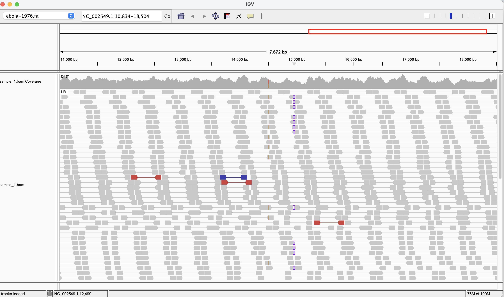
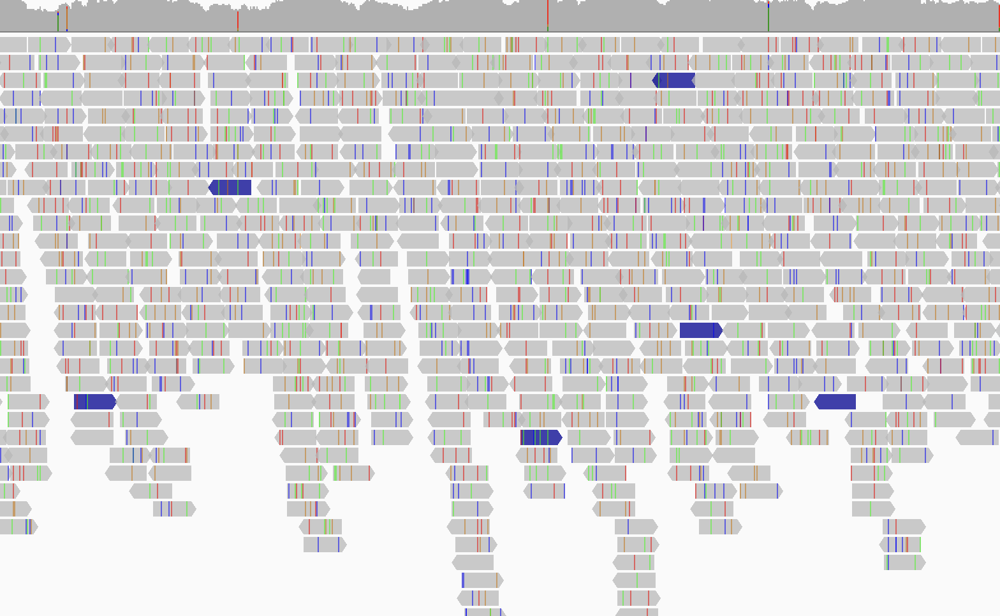
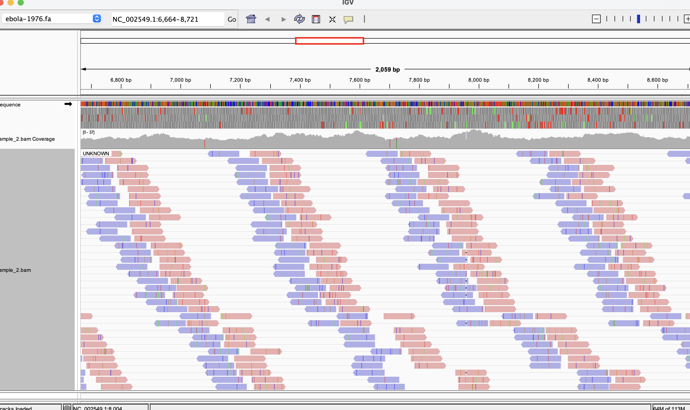
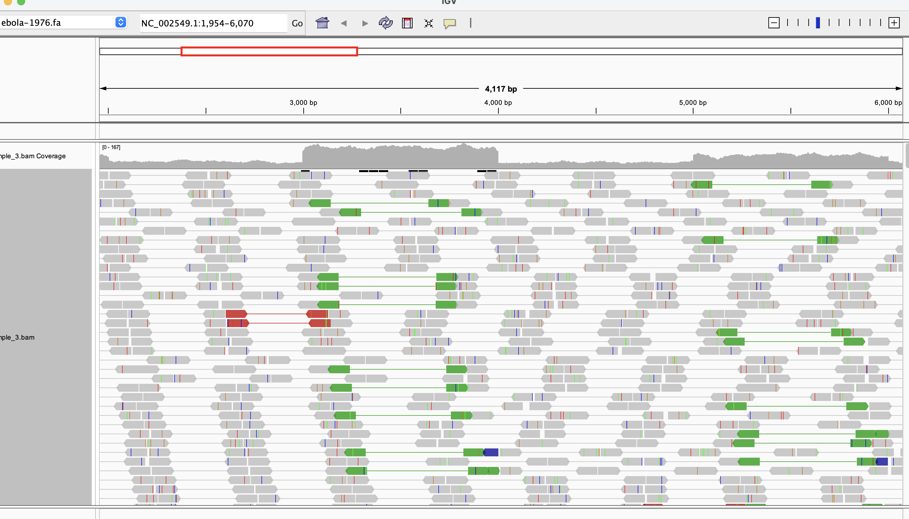
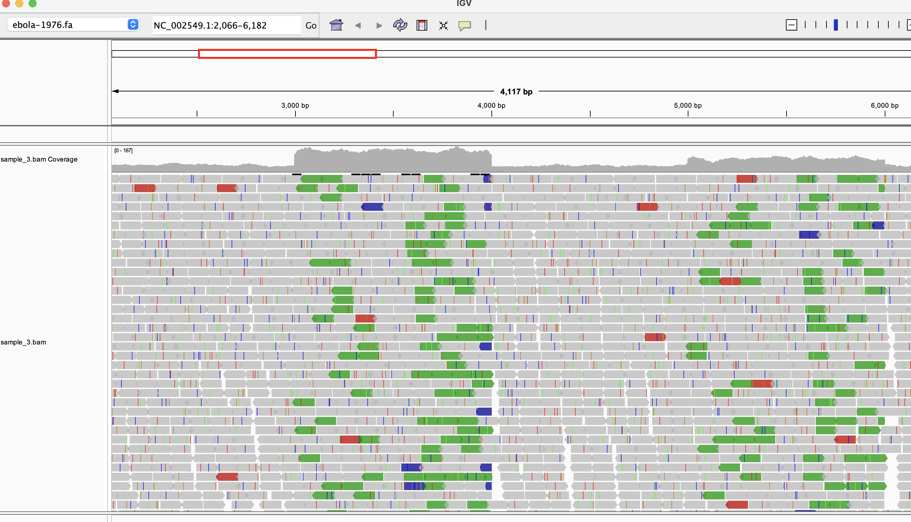
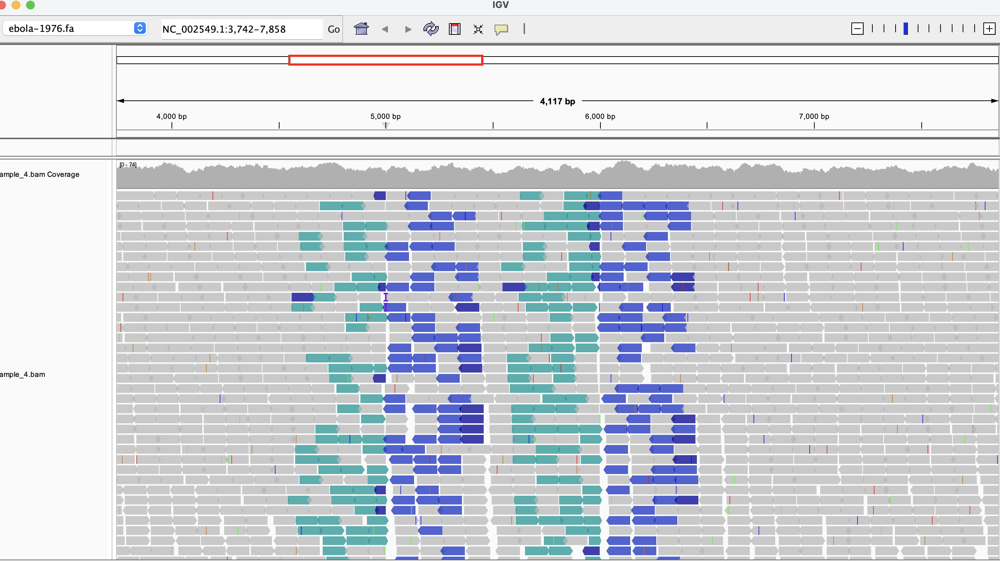
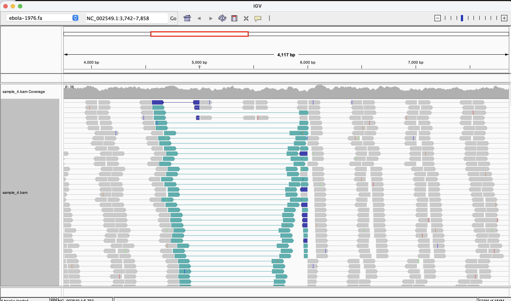
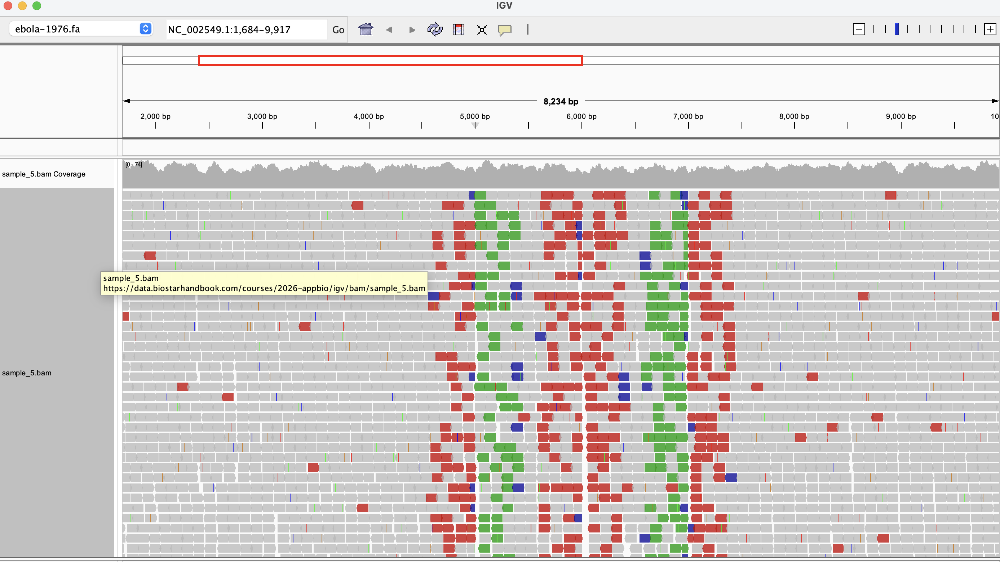
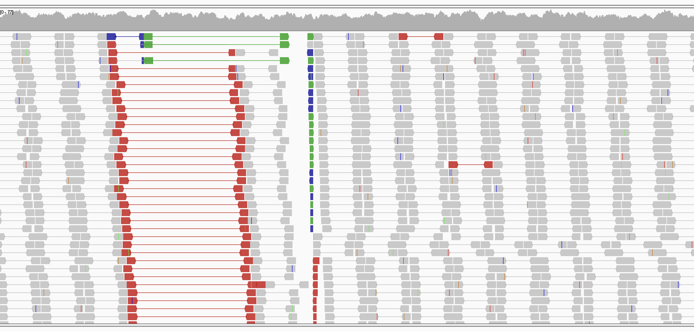

## Homework 6: Evaluate structural variants

The samples were aligned to the Ebola reference genome and examined in IGV. The reads were grouped by pair orientation, and the alignments were colored according to insert size and pair orientation.

### Sample 1

Most read pairs appear consistent with the reference as indicated by the gray color. A few show abnormal spacing, but they do not form an obvious cluster. Red pairs in an otherwise expected-orientation group map farther apart than expected indicate larger inferred insert size. This can support a deletion in the sample relative to the reference. Blue pairs in that group map closer together than expected indicate smaller inferred insert size. This can support an insertion in the sample. Multiple reads support a candidate insertion near 15 kb as indicated by the 'I' letter

### Sample 2

Reads align across the region with generally good but uneven coverage, and most positions agree with the reference sequence, as shown by the predominance of gray read bases. The scattered colored bases represent mismatches or other alignment differences and may result from single base difference, sequencing errors, or low-quality bases. 

### Sample 3

Most read pairs appear consistent with the reference as indicated by the gray color. Red pairs in an otherwise expected-orientation group map farther apart than expected indicate larger inferred insert size. This can support a deletion in the sample relative to the reference. The green strands direction appeared to be flip - left read maps to the reverse strand, and the right read maps to the forward strand indicating tandem duplication
### Sample 4

The scattered colored bases represent mismatches or other alignment differences and may result from single base difference, sequencing errors, or low-quality bases. The large cyan blue color pairs point to same direction, indicating both map to the same strand so inversion

### Sample 5

Most issues out of all samples. Red pairs in an otherwise expected-orientation group map farther apart than expected indicate larger inferred insert size. This can support a deletion in the sample relative to the reference. Blue pairs in that group map closer together than expected indicate smaller inferred insert size. This can support an insertion in the sample. The green strands direction appeared to be flip - left read maps to the reverse strand, and the right read maps to the forward strand indicating tandem duplication or translocation. The scattered colored bases represent mismatches or other alignment differences and may result from single base difference, sequencing errors, or low-quality bases. 
